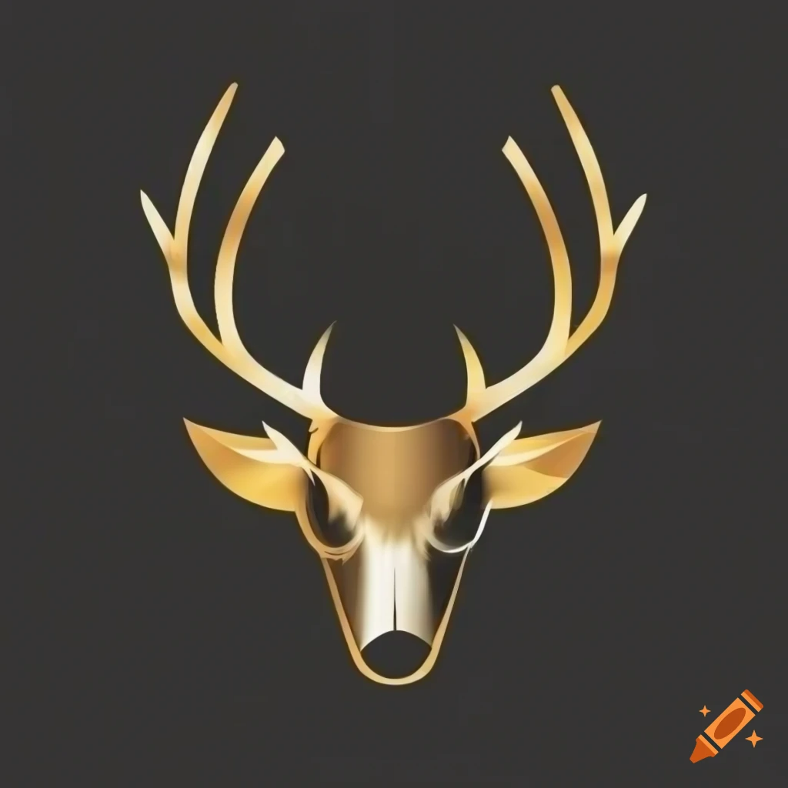

# Deer Sight
## Logo

## Issue
**Overhunting or unregulated hunting can lead to population imbalances and negatively impact ecosystems.**

Population monitoring is a critical aspect of wildlife management, ensuring the sustainable coexistence of species with their environments. Overhunting or unregulated hunting poses a significant threat to wildlife populations, as it can lead to imbalances in ecosystems, impacting biodiversity, ecological interactions, and overall ecosystem health.

1. **Biodiversity Impact:**
   - Overhunting can reduce the population of a particular species, affecting the balance of predator-prey relationships and disrupting the natural order within an ecosystem.
   - A decline in prey species due to overhunting can impact predators, leading to increased competition for limited resources.

2. **Ecosystem Dynamics:**
   - Unregulated hunting can alter the structure and dynamics of ecosystems by disproportionately targeting certain species. This can have cascading effects on vegetation, other animal species, and even water systems.

3. **Genetic Diversity:**
   - Overhunting can reduce the genetic diversity within a population, making it more susceptible to diseases and reducing its ability to adapt to environmental changes.

## Soultion

**AI Solution: AI-Powered Population Monitoring**

1. **Real-Time Surveillance:**
   - AI-powered systems, such as drones or camera networks equipped with computer vision technology, can conduct real-time surveillance of wildlife habitats. These systems continuously capture and analyze visual data, providing up-to-date information on the distribution and behavior of deer populations.

2. **Automated Population Counts:**
   - Computer vision algorithms can be trained to recognize and count individual animals in images or video footage. This enables automated population estimates without the need for manual surveys, which can be time-consuming and logistically challenging.

3. **Behavioral Analysis:**
   - AI can analyze the behavior of deer, helping identify patterns related to feeding, migration, and reproduction. This information is valuable for understanding the natural dynamics of the population and assessing potential impacts of external factors, such as hunting.

4. **Cost-Efficiency and Scalability:**
   - AI-driven monitoring systems offer a cost-effective and scalable solution for large and remote areas. Drones and cameras can cover vast territories, providing comprehensive data that would be challenging to obtain through traditional methods.

In summary, AI-powered population monitoring provides a technological solution to the challenges posed by overhunting and unregulated hunting. By leveraging advanced technologies, wildlife managers can gather accurate, real-time data that forms the basis for evidence-based conservation strategies, promoting the coexistence of humans and wildlife while safeguarding ecosystems for future generations.

## Who would benefit from this?

The implementation of AI-powered population monitoring in the context of wildlife management, specifically for deer populations, can provide benefits to various stakeholders involved in conservation efforts, ecosystem management, and sustainable hunting practices. Here are key beneficiaries:

1. **Hunters and Hunting Communities:**
   - Responsible hunters and hunting communities benefit from sustainable hunting practices supported by accurate population data. AI-powered monitoring can contribute to the establishment of reasonable and enforceable hunting quotas, ensuring that hunting activities align with conservation goals.

2. **Local Communities and Indigenous Peoples:**
   - Local communities that coexist with deer populations may benefit from AI-powered monitoring through enhanced ecosystem health. Sustainable management practices can contribute to the preservation of traditional lifestyles that may involve hunting as a cultural or subsistence activity.

3. **Tourism Industry:**
   - Regions that attract wildlife enthusiasts and ecotourists benefit when deer populations are healthy and ecosystems are well-managed. AI-powered monitoring can contribute to maintaining biodiversity, making these areas more attractive for eco-tourism.

4. **Animal Welfare Advocates:**
   - Individuals and organizations advocating for animal welfare benefit from AI systems that contribute to the ethical and sustainable management of deer populations. Monitoring can help prevent overexploitation and mitigate negative impacts on animal welfare.

5. **Technology Developers and Providers:**
   - Companies and innovators in the field of AI and conservation technology benefit from the development and implementation of advanced monitoring systems. This creates opportunities for technological innovation and the provision of solutions for wildlife management challenges globally.

It's important to emphasize that the benefits depend on responsible and ethical implementation of AI technologies, with a focus on conservation ethics, community engagement, and consideration of the welfare of both wildlife and human populations. Collaborative efforts among various stakeholders are crucial for the successful integration of AI-powered population monitoring into wildlife management practices.

## Results
### Training Progression Over Time
The two graphs below are indicating the accuracy and the loss for the training run.
### Accuracy of Training Model (Alexnet)

### Loss

### Run Summary (Training accuracy/loss)
Training Accuracy - 0.96875

Training Loss - 0.34451

A high training accuracy strongly indicates that the alexnet model is able to distinguish between the woods area and the woods area with a deer in it. This could get better feeding it harder photos where the deers blend in more.

## Feature Maps
[Feature Maps](https://colab.research.google.com/drive/17-_aCg_DCBc31-3YXe_3Q6xBmXMNDjas?usp=sharing)

Feature maps are intermediate representations of an input image generated by a convolutional neural network (CNN) during the process of convolution. Each layer in a CNN produces feature maps that highlight certain patterns or features present in the input image. For Deer Sight these feature maps can be useful for tasks like object detection, including finding a deer in an image. Here's how feature maps can help you in this context:

1. **Pattern Detection:**
   - Feature maps highlight patterns and textures present in different regions of an image.
   - Certain feature maps might respond strongly to patterns that resemble the texture or shape of a deer, such as antlers or the body outline.

2. **Localization:**
   - The location of strong activations in a feature map can help localize where potential deer-like features are present in the input image.
   - By analyzing the spatial distribution of activations, you can identify regions that are more likely to contain a deer.

3. **Hierarchy of Features:**
   - CNNs have multiple layers with increasing levels of abstraction. Lower layers focus on simple patterns like edges, while higher layers represent more complex features.
   - Analyzing feature maps across different layers allows you to understand the hierarchical representation of features. For example, lower layers might capture the edges of the deer, while higher layers may capture more abstract features like the overall shape.

4. **Heatmaps:**
   - You can generate heatmaps by aggregating the activations from multiple feature maps. Heatmaps visually represent the areas of an image where the model is most confident in predicting the presence of a specific object, like a deer.
   - By overlaying the heatmap on the input image, you can quickly identify regions that contribute the most to the model's decision.

5. **Data Augmentation:**
   - Augmenting your dataset with variations of deer images can help the model generalize better. Feature maps can show how well the model generalizes to different poses, lighting conditions, and backgrounds.

While these feature maps may be able to help in the sight seeing of catching a deer it may need more deep learning so that it is able to detect harder deer that tend to blend into the background. Visualization tools and techniques, such as activation maximization and Grad-CAM (Gradient-weighted Class Activation Mapping), can aid in understanding the contribution of different regions in the image to the model's predictions.

## Pose Machine

## Data Deck
[Data Set](https://docs.google.com/presentation/d/1B1Haahqh5MBBZjjTAZ36SaNoPWzI_aaLMzs11wI5utI/edit#slide=id.g1e5fe554c84_0_138)

## Alexnet Code
[Alexnet](https://colab.research.google.com/drive/1tw061zY6h9vZR_zn6XqUXWLfXRVJruhV?usp=sharing)

